# UpPlan
A 3D map of Faculty of Computer Science & Information Technology in University Putra Malaysia. The map uses Augmented Reality technology which was developed using Unity, Vuforia and Blender.

## NOTICE
• Only Open Map feature is available

## How to install
1. Open this page in your mobile

2. Click "View code" link if list of project file and folder is not visible.

3. Click on "UpPlan.apk" link and you will be navigated to a new page.

4. Click on "Download" button and your download should be in progress.

5. Once download is complete, open the UpPlan.apk file. Don't worry there is no malicious content, I pinky promise you.

6. When prompted  "Do you want to install this application?", click on "INSTALL" option and your installation should be in progress.

7. Once installation is complete, click "Open" option and you shall explore the application. Remember to allow camera access when prompted. This is for the app to use your camera when displaying the 3D map.

## MAIN MENU

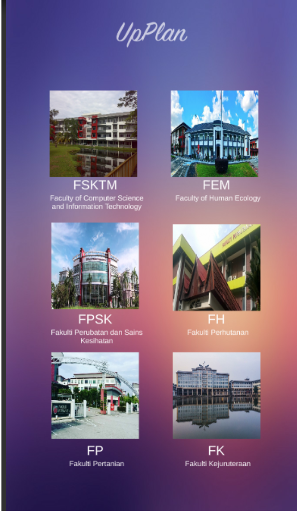

When you start up the app , you will be directed to the Main Menu. Here you can choose from a list of location to explore. There are 6 options provided but only one works for now and that is the “FSKTM” option. Click on “FSKTM” option to proceed.

## LOCATION MENU

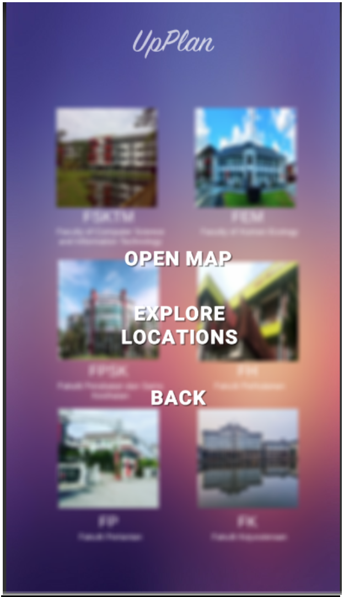

Once you choose a location, you will see a pop-up which is a Destination Menu. Here you can select:

• Open Map to proceed to the 3D map.

• Explore Locations to search for a specific location

• Back to return to Main Menu

## SPECIFIC LOCATION MENU

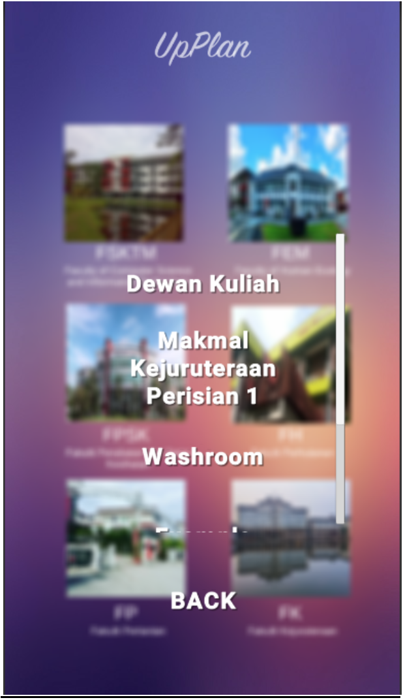

If you selected Explore Locations in the Location Menu you will see a list of locations and that will be the Specific Location Menu. Selecting one of these locations will not only show you the 3D map but also the navigations to the selected specific location.

## IMAGE TARGET

If you have selected “Open Map” or selected a specific location, your phone camera should start up (Please allow camera access, if you are prompted to).The 3D map should appear on the camera. However, it requires an image target to do so. Please use the UpPlan image target which is shown below. Place the image target under the phone camera. The 3D map will then appear on top of the image target.
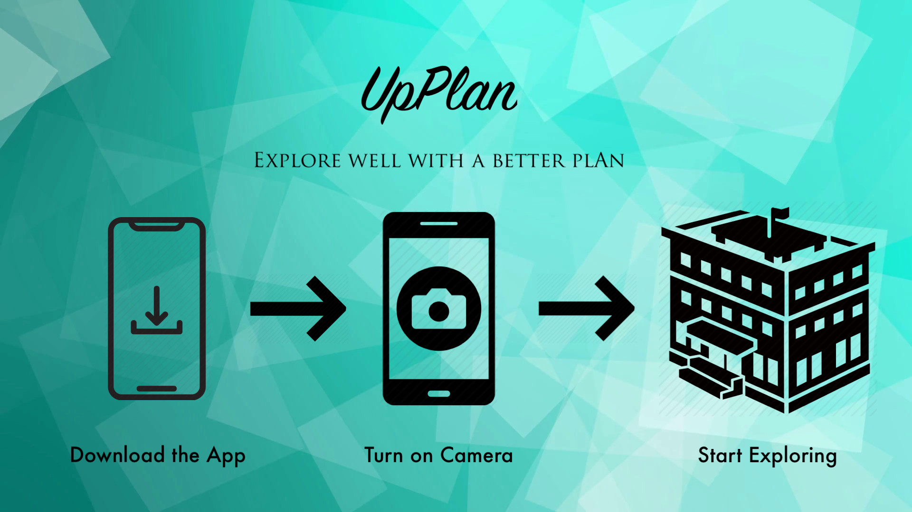

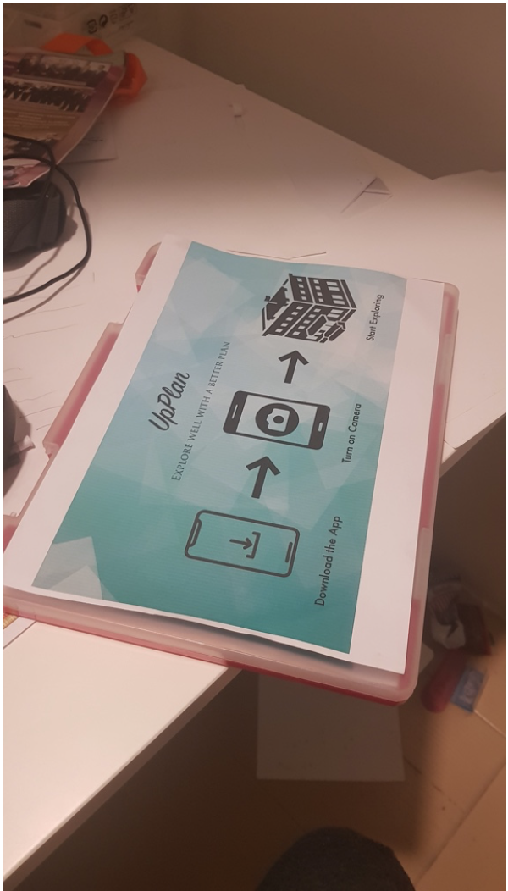                   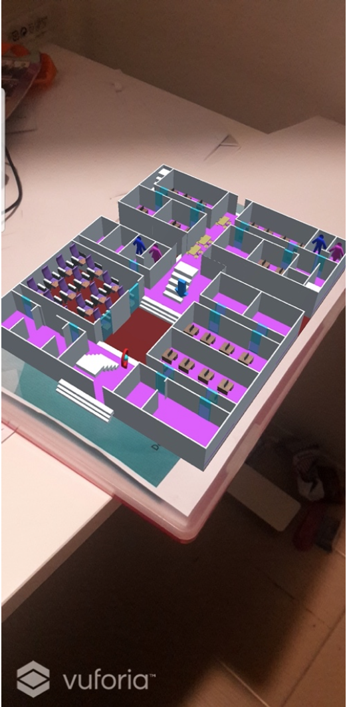

## 3D MAP
The 3D map is just like a floor plan that you see in shopping malls but it is 3D. You can use it to identify or explore locations. You can request navigations to a specific location.

### YOUR LOCATION

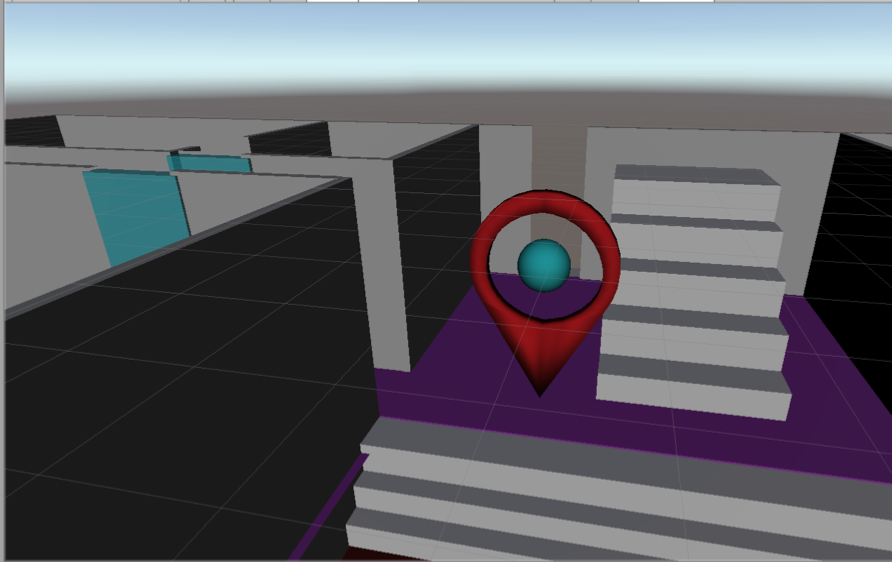

The Location Marker shown in above indicates your position in the map. The Location Marker is static and will not move because the image targets are designed to be only in a specific location. It will consistently rotate from the start of the application.

### NAVIGATING YOURSELF TO A LOCATION

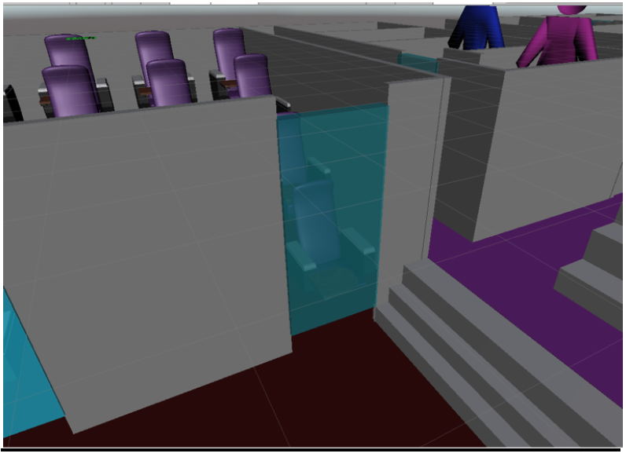
      
Each room has a transparent blue door. Aim the camera towards the door and click the door like you are shooting rays from your fingers. The door will turn green and a set of light blue chevrons will line up from the Location Marker to the targeted room.

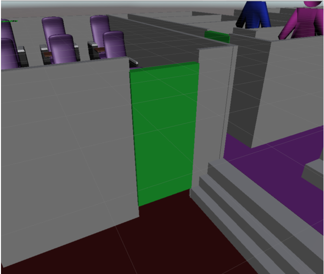
    
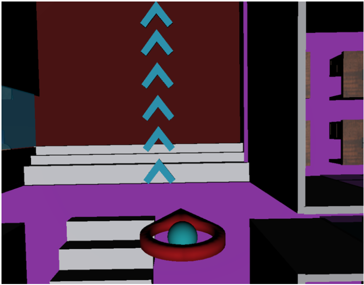

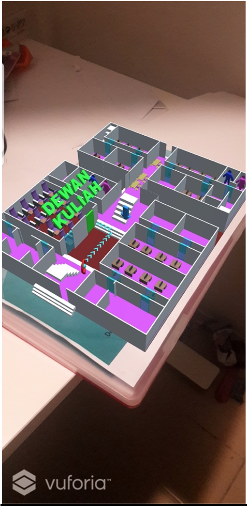

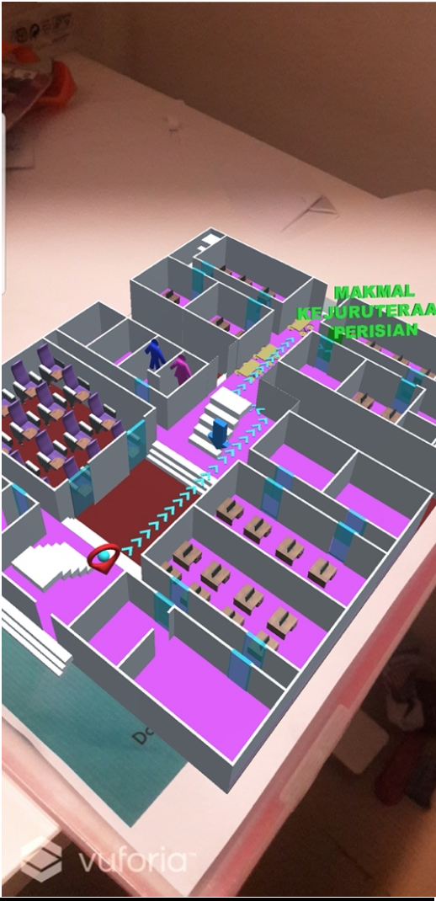

### CHANGING LEVELS

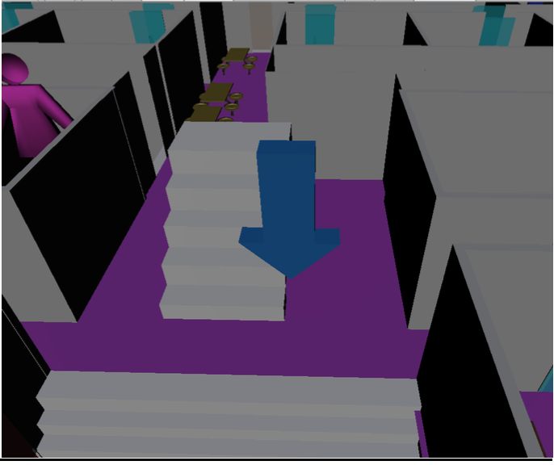

At the centre of the 3D map, you will find a blue coloured arrow pointing downwards. This arrow is the level button. The level button sends you a floor up. If you reach the top floor and press it again , it will send you to the ground floor. When you select it the arrow will shake and turn green until the next floor is loaded.

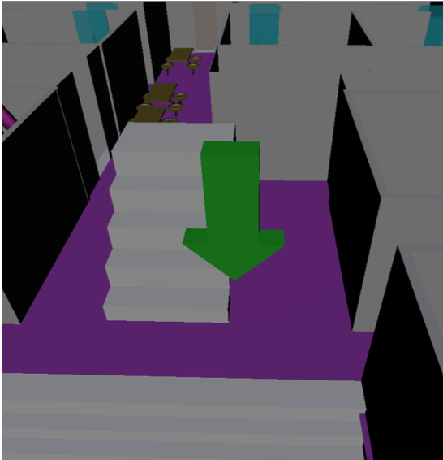
